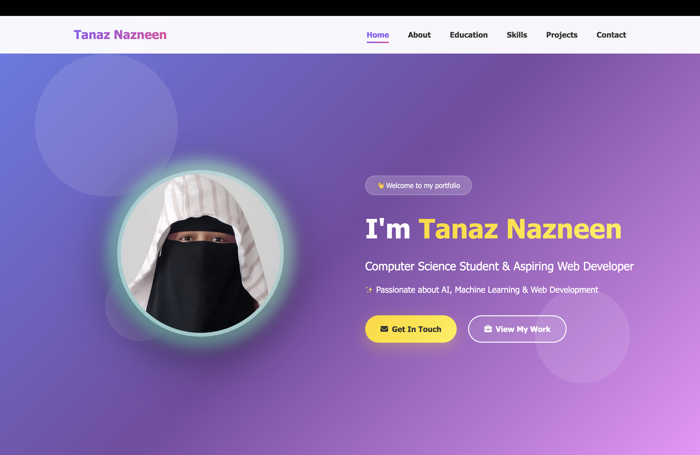
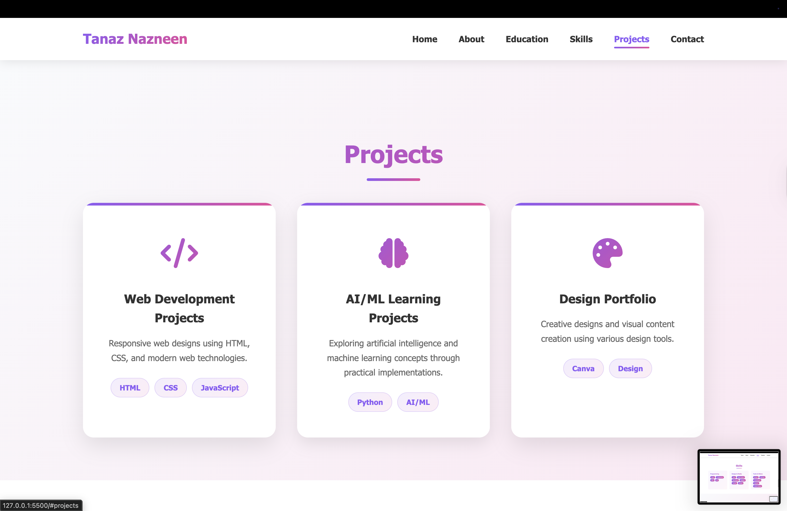

## EDULUMOUS-INTERNSHIP-TASKS
Front-end project developed for the EduLumos Internship Program
## Personal Portfolio Website

This project was developed as part of my internship learning experience at **EduLumos**.

## 🚀 Live Demo
👉 https://tanaz786.github.io/edulumous-personal-portfolio/

## Overview
The portfolio highlights my skills, projects, and learning journey using modern web development practices. The goal was to build a clean, maintainable, and well-documented project.

## Tech Stack
- HTML5
- new_profile.jpg
- CSS3 (Flexbox, Media Queries)
- JavaScript (DOM manipulation)
- Git & GitHub

## Screenshots

### Home Page

### Projects Section

## Use of Amazon Q
Amazon Q was used as an AI-assisted development tool during the project to:
- Assist with debugging and error resolution
- Improve code readability and structure
- Understand best practices and alternative approaches

All suggestions were reviewed and implemented manually to ensure correctness and originality.

## What I Learned
- Writing maintainable and structured code
- Debugging real-world issues
- Using AI tools responsibly in development workflows
- Version control and documentation practices

## Organization
This project was completed during my internship at **EduLumos** as part of my skill development.
